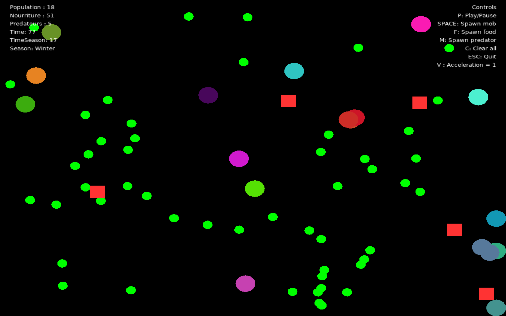

# 🌱 ecosystem-simulation
An interactive ecosystem simulation built with **LÖVE2D (Lua)** where creatures evolve, reproduce, and survive in a dynamic environment with changing seasons.

<br>



<br>

## About
This is a small personal project I'm developing to practice learning Lua and to explore algorithms related to simulation.

## Game overview
- **Mobs** *(colored circle)* that search for foods and reproduce but grow old
- **Predators** *(red square)* that search for mobs and can't reproduce but grow old *update soon*
- **Foods** *(small green circle)* that spawn according to seasons
- **Seasonal system** with timer and generation of resources more or less important in relation to the season

## Features Entity
### Mobs 
        size = 20,
        x = x or math.random(50, baseWidth - 50),
        y = y or math.random(50, baseHeight - 50),
        speed = 0,
        dirX = 0,
        dirY = 0,
        energy = 15,
        health = 10,
        foodsEaten = 0,
        detectionRadius = math.random(100, 180),
        color = {math.random(), math.random(), math.random()},
        timerLife = 0,
        maxTimeLive = math.random(100, 180)
### Predators
        size = 15,
        x = x or math.random(50, baseWidth - 50),
        y = y or math.random(50, baseHeight - 50),
        speed = 0,
        dirX = 0,
        dirY = 0,
        energy = 15,
        health = 10,
        detectionRadius = math.random(100, 120),
        color = {1, 0.2, 0.2},
        timerLife = 0,
        maxTimeLive = math.random(200, 260)
### Foods
        size = 10,
        x = x or math.random(20, baseWidth - 20),
        y = y or math.random(20, baseHeight - 20),

## Simulation mechanics
- Energy and health system for all entities
- Genetic reproduction *(parental color mixing)*
- Aging and natural death
- Basic artificial intelligence *(food seeking, predator avoidance)*
- Season system *(Summer, Autumn, Winter, Spring)*

## Interface
**At the top-left corner of the window**, we display key simulation information such as real-time data, seasonal changes, and a timer that starts when the simulation begins.<br>
**In the top-right corner**, users can find controls for managing the simulation, including a list of available keyboard shortcuts to interact with the environment.

## Controls

### Main Controls

| Keys   | Action                 |
|--------|------------------------|
| P      | Pause / Play simulation|
| ESC    | Exit simulation        |
| F11    | Fullscreen             |

### Entity Spawning

| Keys   | Action                 |
|--------|------------------------|
| SPACE  | Spawn a mob            |
| F      | Spawn food             |
| M      | Spawn a predator       |

### Simulation Management

| Keys   | Action                 |
|--------|------------------------|
| V      | Adjust simulation speed|
| C      | Clear all entities     |

## Installation

### Prerequisites
- [LÖVE2D](https://love2d.org/) (version 11.0 or newer)

### Quick Start
1. Download and install LÖVE2D
2. Clone this repository:
```bash
git clone https://github.com/KodeSeishin/ecosystem-simulation.git
cd ecosystem-simulation
```
3. Run the simulation
```bash
love .
```
## How to Play
1. Press **P** to start the simulation
2. Watch creatures search for food and reproduce
3. Observe how seasons affect food availability
4. Use controls to spawn entities and manage simulation

## Known Issues
- Predators cannot reproduce yet (planned feature)
- Performance may drop with 100+ entities

## Future Updates
- [ ] Predator reproduction system
- [ ] Save/load functionality
- [ ] Virus / infection
- [ ] Death particle
- [ ] Change the background

### 🤝 Contributing

> This project is constantly evolving, and any help is warmly welcome!  
Whether you're a developer, designer, or simply passionate, feel free to suggest ideas, report bugs, or contribute directly to the code.

⭐ **If you like the project, consider leaving a star to support and spread the word!**

